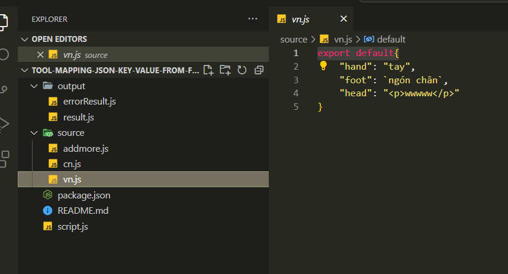

## project này là phiên bản nodeJS của project https://github.com/tonguyenducmanh/tool-mapping-json-key-value
## lưu ý máy tính cần cài node js bản 16 trở lên để có thể sử dụng được cú pháp import trong file js
## trường hợp có nhiều version node js thì dùng nvm để quản lý và chạy nvm use 16
## Để sử dụng làm theo các bước sau
copy lần lượt các file object vào thư mục source theo dạng export default, trong đó vn.js là file ngôn ngữ gốc, cn.js là file ngôn ngữ đích, addmore.js là các cặp key value đã dịch thêm

sau khi add xong thì mở terminal bằng ctrl + ` gõ lệnh node script.js hoặc ấn f5 tại vscode rồi chọn nodejs
kết quả sẽ được xuất ra file result.js và file errorResult.js trong file output